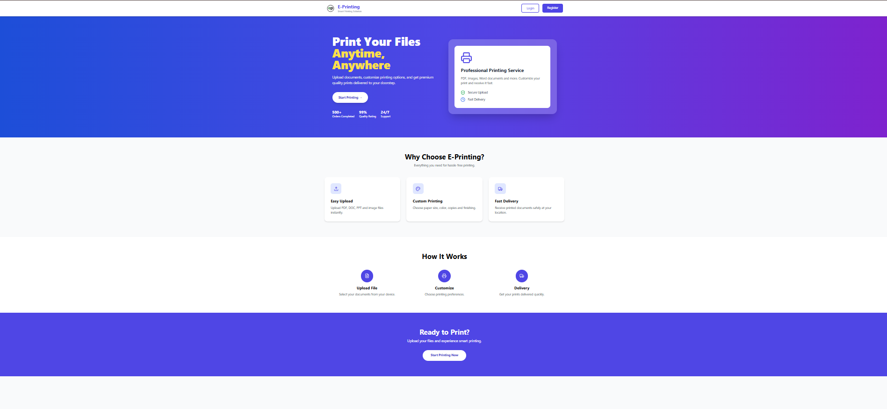
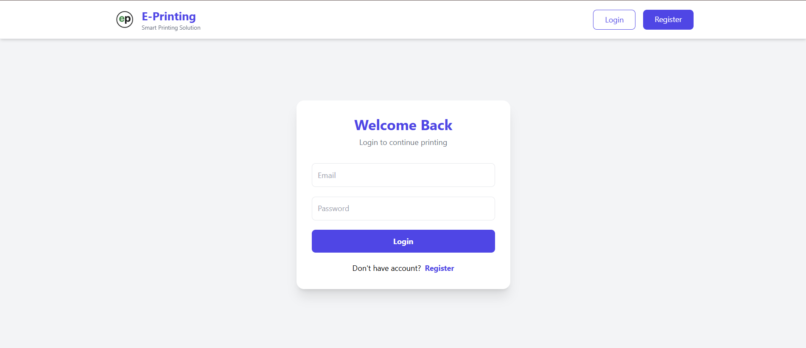
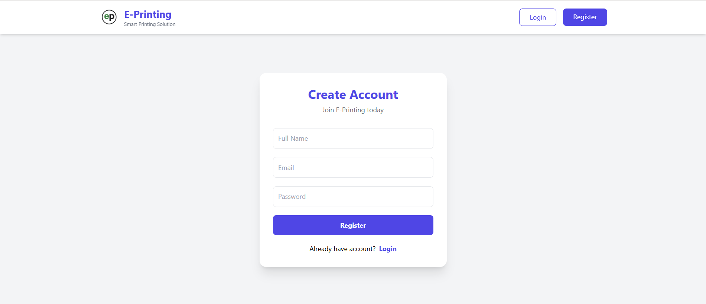
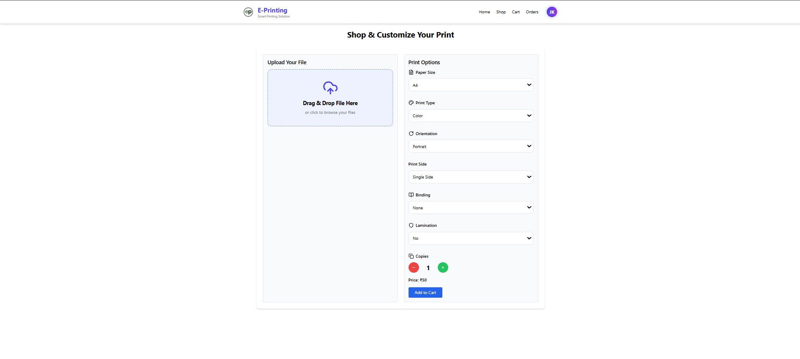
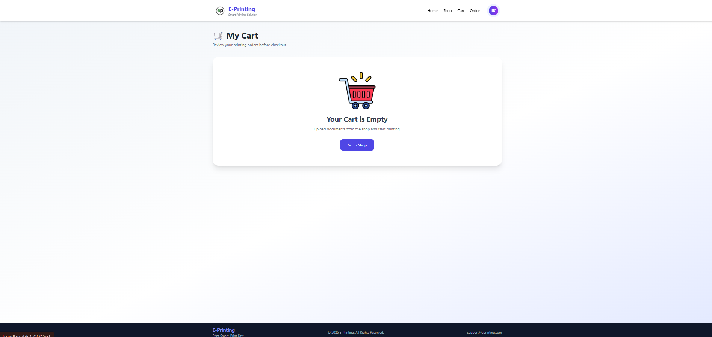
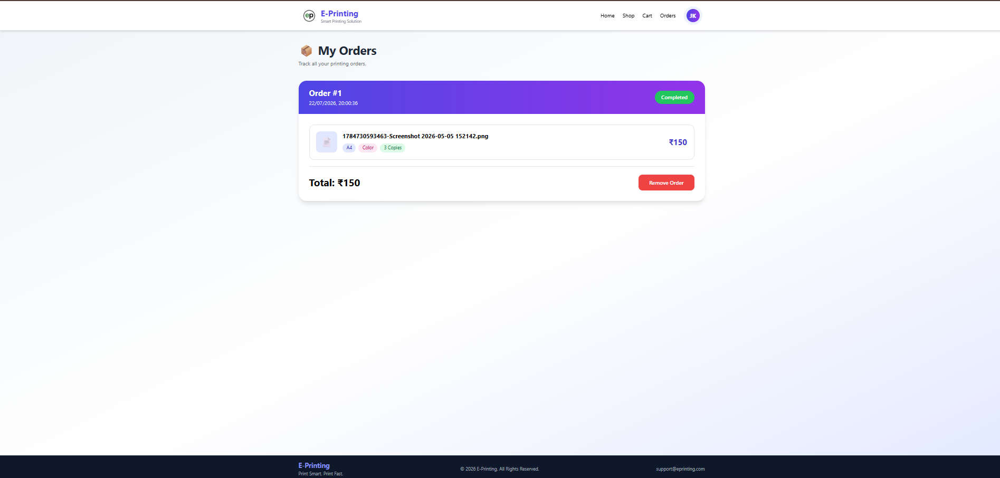
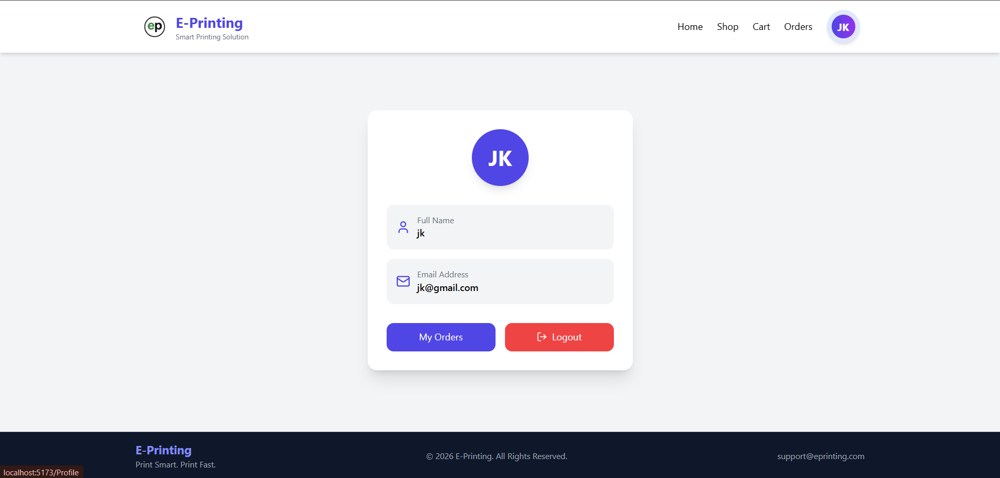

# 🖨️ E-Printing – Smart Online Document Printing Platform

<p align="center">


</p>

A modern **Full Stack Online Printing Platform** that enables users to upload documents, customize print settings, manage a shopping cart, and place print orders seamlessly. Designed with a responsive and intuitive interface, the application delivers a smooth user experience while maintaining secure authentication and efficient order management.

---

## 🌐 Live Demo


---

# 📖 Overview

E-Printing simplifies the traditional printing process by allowing users to upload files online, configure printing preferences, and place orders without visiting a print shop.

The platform supports multiple document formats, dynamic pricing, secure user authentication, and complete order management.

---

# ✨ Key Features

## 🔐 User Authentication

- User Registration
- Secure Login
- JWT Authentication
- User Profile
- Logout

---

## 📂 File Upload

- Drag & Drop Upload
- Click to Browse Files
- Image Preview
- PDF Support
- Word Document Support
- HEIC Image Conversion
- Secure File Storage

---

## 🖨️ Print Configuration

- Paper Size Selection
- Color / Black & White Printing
- Multiple Copies
- Dynamic Price Calculation

---

## 🛒 Shopping Cart

- Add Print Jobs
- Remove Items
- Live Total Price
- Order Summary
- Checkout

---

## 📦 Order Management

- Order History
- Order Details
- Remove Orders
- Order Date & Time
- Responsive Order Cards

---

## 🎨 Modern UI

- Fully Responsive
- Mobile Friendly
- Clean Dashboard
- Beautiful Cards
- Smooth Animations
- Modern Color Palette

---

# 🛠 Tech Stack

## Frontend

| Technology | Purpose |
|------------|----------|
| React.js | UI Development |
| React Router DOM | Routing |
| Tailwind CSS | Styling |
| Axios | API Communication |
| Lucide React | Icons |

---

## Backend

| Technology | Purpose |
|------------|----------|
| Node.js | Runtime |
| Express.js | REST APIs |
| MongoDB | Database |
| Mongoose | ODM |
| JWT | Authentication |
| Multer | File Upload |

---

# 📂 Project Structure

```text
E-Printing/
│
├── frontend/
│   ├── public/
│   ├── src/
│   │
│   ├── assets/
│   ├── components/
│   ├── context/
│   ├── pages/
│   ├── services/
│   ├── App.jsx
│   └── main.jsx
│
├── backend/
│
├── models/
├── routes/
├── uploads/
├── server.js
│
├── images/
└── README.md
```

---

# 📸 Application Screenshots

## 🏠 Home Page



---

## 🔑 Login Page



---

## 📝 Registration Page



---

## 🛍 Shop Page



---

## 🛒 Cart Page



---

## 📦 Orders Page



---

## 👤 Profile Page



---

# 🚀 Installation Guide

## Clone Repository

```bash
git clone https://github.com/moukhil/e-printing.git
```

---

## Navigate into Project

```bash
cd e-printing
```

---

## Install Frontend

```bash
cd frontend
npm install
npm run dev
```

---

## Install Backend

```bash
cd backend
npm install
npm start
```

---

# ⚙ Environment Variables

Create a `.env` file inside the backend folder.

```env
PORT=5000

MONGO_URI=mongodb://127.0.0.1:27017/o-printing

JWT_SECRET=your_secret_key
```

---

# 🔗 REST API

## Authentication

| Method | Endpoint | Description |
|---------|----------|-------------|
| POST | /api/auth/register | Register User |
| POST | /api/auth/login | Login User |
| GET | /api/auth/profile/:id | Get User Profile |

---

## File Upload

| Method | Endpoint |
|---------|----------|
| POST | /api/upload |

---

## Cart

| Method | Endpoint |
|---------|----------|
| GET | /api/cart |
| POST | /api/cart |
| DELETE | /api/cart/:id |

---

## Orders

| Method | Endpoint |
|---------|----------|
| GET | /api/orders |
| POST | /api/orders |
| DELETE | /api/orders/:id |

---

# 📈 Workflow

```text
Register
      │
      ▼
Login
      │
      ▼
Upload Document
      │
      ▼
Choose Print Options
      │
      ▼
Add to Cart
      │
      ▼
Checkout
      │
      ▼
Order History
```

---

# 🔮 Future Improvements

- 💳 Razorpay / Stripe Payment Gateway
- 📍 Live Delivery Tracking
- 📧 Email Notifications
- 📱 SMS Notifications
- 🖨 Print Preview
- 📦 Admin Dashboard
- ⭐ User Reviews
- 🎟 Coupon System
- ☁ Cloud Storage
- 📊 Analytics Dashboard

---

# 🤝 Contributing

Contributions are welcome!

1. Fork the repository
2. Create a feature branch

```bash
git checkout -b feature-name
```

3. Commit changes

```bash
git commit -m "Added new feature"
```

4. Push

```bash
git push origin feature-name
```

5. Open a Pull Request

---

# 👨‍💻 Author

**Shaik Moukhil**

Full Stack Developer | Java Developer | MERN Stack Developer

### Connect with Me

- GitHub: https://github.com/moukhil
- LinkedIn: https://linkedin.com/in/moukhil-shaik
- Email: yourmail@gmail.com

---

# ⭐ Support

If you found this project useful, please consider giving it a **Star ⭐** on GitHub.

It helps others discover the project and motivates further improvements.

---

<p align="center">
Made with using React, Node.js, Express.js and MongoDB
</p>